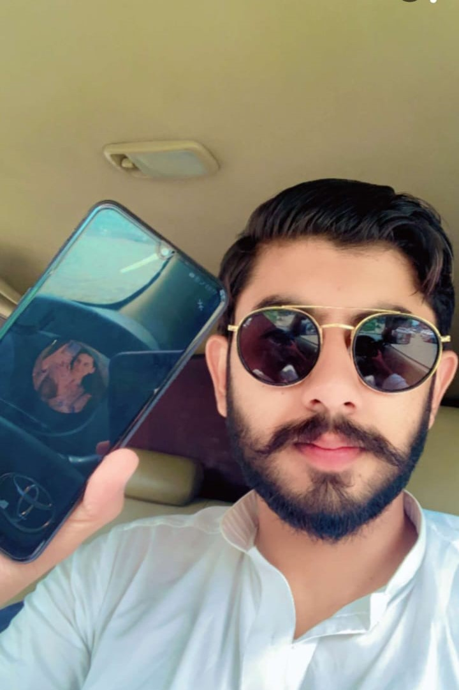

<html lang="en">
<head>
    <meta charset="UTF-8">
    <meta name="viewport" content="width=device-width, initial-scale=1.0">
    <title>Proud Message</title>
    
</head>
<body>
    

        
 hi habibi <3 i miss you so much :( tum itna pyaara lag raha hai mujhe abhi mei kya bataon. liken sath yaad bhi bohat aarhai hai. 
            ganday ho tum pata hai tumnay? liken jaan ho meri puri ki puri ^-^ my baby boo and my baby bear wo bhi humesha k liya hehe 
            anyhow i wanted to tell you that i love you so very much and im so proud of you!! 
            and we're going on a date very soon :)<3 
            with lots of love, cuddles and kisses 
            mehr bano sardar 
            & your begum 

        
    

</body>
</html>
